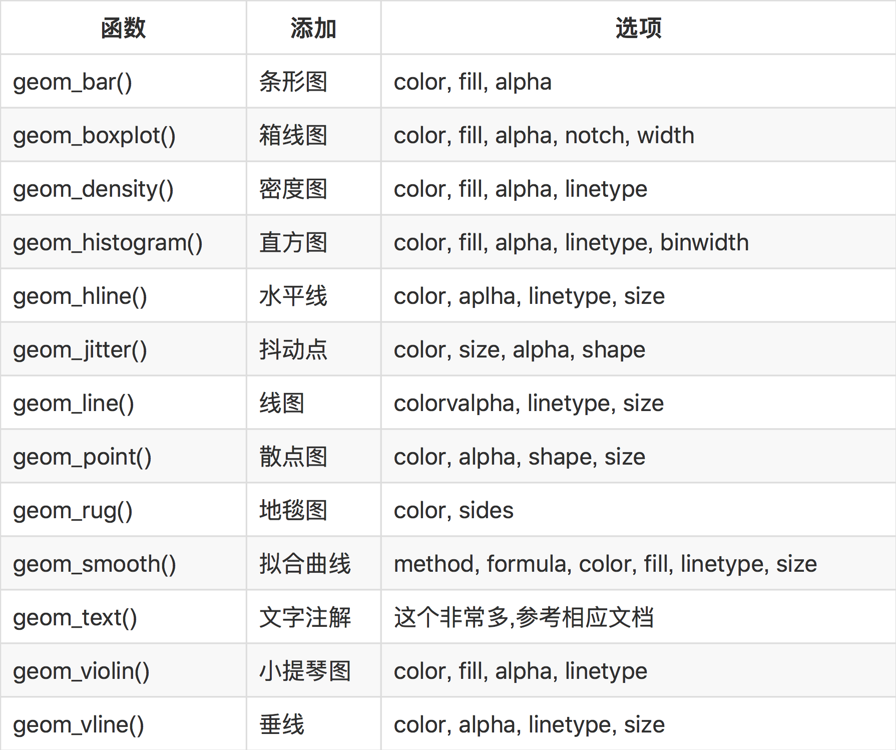

# An Introduction of ggplot2

 * Clone the git
 * Double-click 'ggplot2_PPT.html'
 * Have a fun!

The presentation is made by [xaringan](https://github.com/yihui/xaringan).


## The summary of PPT
---
title: "利用ggplot2进行绘图"
author: "蒋宇康"
date: "2017/10/29"
output:
  xaringan::moon_reader:
    css: [default, zh-CN.css]
    lib_dir: libs
    nature:
      highlightStyle: github
      highlightLines: true
      countIncrementalSlides: false

---
class: center, middle, inverse

# ggplot2是什么？

---
class: center, middle

# 一个用来绘制统计图形(不只是统计图形)的R包！

---
class: center, middle, inverse

# ggplot2能画出什么样的图？

---

# 风骚的图片

```{r, echo = FALSE, message = F, warning = F, fig.align = 'center', out.width = '700px', out.height = '450px', dev='svg'}
library(GGally)
library(ggplot2)
lm_with_cor <- function(data, mapping, ..., method = "pearson") {
  x <- eval(mapping$x, data)
  y <- eval(mapping$y, data)
  cor <- cor(x, y, method = method)
  ggally_smooth_lm(data, mapping, ...) +
    ggplot2::geom_label(
      data = data.frame(
        x = min(x, na.rm = TRUE),
        y = max(y, na.rm = TRUE),
        lab = round(cor, digits = 3)
      ),
      mapping = ggplot2::aes(x = x, y = y, label = lab),
      hjust = 0, vjust = 1,
      size = 5, fontface = "bold",
      inherit.aes = FALSE # do not inherit anything from the ...
    )
}
psych_variables <- attr(psychademic, "psychology")
academic_variables <- attr(psychademic, "academic")
ggduo(
  psychademic, rev(psych_variables), academic_variables,
  mapping = aes(color = sex),
  types = list(continuous = wrap(lm_with_cor, alpha = 0.25)),
  showStrips = FALSE,
  title = "Between Academic and Psychological Variable Correlation",
  xlab = "Psychological",
  ylab = "Academic",
  legend = c(5,2)
) +
  theme(legend.position = "bottom", plot.title = element_text(hjust = 0.5))
        
```

---

# 风骚的图片

```{r, echo = FALSE, message = F, warning = F, fig.align = 'center', out.width = '700px', out.height = '450px', dev='svg'}
library(GGally)
library(ggplot2)
pigs_dt <- pigs[-(2:3)] # remove year and quarter
pigs_dt$profit_group <- as.numeric(pigs_dt$profit > mean(pigs_dt$profit))
# make the profit group as a factor value
profit_groups <- c(
  "1" = "high",
  "0" = "low"
)
pigs_dt$profit_group <- factor(
  profit_groups[as.character(pigs_dt$profit_group)],
  levels = unname(profit_groups),
  ordered = TRUE
)
pigs_mapping <- aes(color = profit_group)
pigs_types <- list(
  comboHorizontal = wrap(ggally_facethist, binwidth = 1)
)
ggts(pigs_dt, pigs_mapping, "time", 2:7, types = pigs_types, legend = c(6,1))
        
```


---

# 风骚的图片

```{r, echo=FALSE, message = F, warning = F, fig.align = 'center', out.width='500px', out.height='450px', dev='svg'}
library(ggraph)
library(igraph)
flareGraph <- graph_from_data_frame(flare$edges, vertices = flare$vertices)
flareGraph <- treeApply(flareGraph, function(node, parent, depth, tree) {
  tree <- set_vertex_attr(tree, 'depth', node, depth)
  if (depth == 1) {
    tree <- set_vertex_attr(tree, 'class', node, V(tree)$shortName[node])
  } else if (depth > 1) {
    tree <- set_vertex_attr(tree, 'class', node, V(tree)$class[parent])
  }
  tree
})
V(flareGraph)$leaf <- degree(flareGraph, mode = 'out') == 0

ggraph(flareGraph, 'treemap', weight = 'size') + 
  geom_treemap(aes(fill = class, filter = leaf, alpha = depth), colour = NA) + 
  geom_treemap(aes(size = depth), fill = NA, colour = 'white') + 
  geom_node_text(aes(filter = depth == 1, label = shortName), size = 3) +
  scale_fill_brewer(type = 'qual', palette = 3, guide = 'none') + 
  scale_size(range = c(3, 0.2), guide = 'none') + 
  scale_alpha(range = c(1, 0.6), guide = 'none') +
  ggforce::theme_no_axes() +
  theme(panel.border = element_blank())
```

---

# 风骚的图片

```{r, echo=FALSE, message = F, warning = F, fig.align = 'center', out.width='700px', out.height='450px', dev='svg'}
library(ggmuller)
edges <- get_edges(example_df)
# extract the adjacency matrix from the data frame:
pop_df <- get_population_df(example_df)
# create data frame for plot:
Muller_df <- get_Muller_df(edges, pop_df)
require(RColorBrewer) # for the palette
# draw plot:
num_cols <- length(unique(Muller_df$RelativeFitness)) + 1
Muller_df$RelativeFitness <- as.factor(Muller_df$RelativeFitness)
Muller_plot(Muller_df, colour_by = "RelativeFitness",
            palette = rev(colorRampPalette(brewer.pal(9, "YlOrRd"))(num_cols)),
            add_legend = TRUE) +
  theme_bw() + 
  theme(panel.grid =element_blank(),    ## 删去网格线
        axis.text = element_blank(),    ## 删去刻度标签
        axis.ticks = element_blank(),   ## 删去刻度线
        axis.title = element_blank(),   ## 删去xy轴标题
        panel.border = element_blank(), ## 删去外层边框
        legend.position = "none")       ## 隐藏所有图例

        
```


---

# 风骚的图片

```{r, echo=FALSE, message = F, warning = F, fig.align = 'center', out.width='700px', out.height='450px', dev='svg'}
library(ggmap)
library(ggplot2)
violent_crimes <- subset(crime,
                         offense != "auto theft" &
                           offense != "theft" &
                           offense != "burglary"
)
# rank violent crimes
violent_crimes$offense <-
  factor(violent_crimes$offense,
         levels = c("robbery", "aggravated assault",
                    "rape", "murder")
  )

# restrict to downtown
violent_crimes <- subset(violent_crimes,
                         -95.39681 <= lon & lon <= -95.34188 &
                           29.73631 <= lat & lat <=  29.78400
)
# crime example by month
levels(violent_crimes$month) <- paste(
  toupper(substr(levels(violent_crimes$month),1,1)),
  substr(levels(violent_crimes$month),2,20), sep = ""
)
# houston <- get_map(location = "houston", zoom = 14, source = "osm", color = "bw")
houston <- get_map("houston", zoom = 14)
HoustonMap <- ggmap(houston,
                    base_layer = ggplot(aes(x = lon, y = lat), data = violent_crimes)
)
HoustonMap +
  stat_density2d(aes(x = lon, y = lat, fill = ..level.., alpha = ..level..),
                 bins = I(5), geom = "polygon", data = violent_crimes) +
  scale_fill_gradient2("Violent\nCrime\nDensity",
                       low = "white", mid = "orange", high = "red", midpoint = 500) +
  labs(x = "Longitude", y = "Latitude") + facet_wrap(~ month) +
  scale_alpha(range = c(.2, .55), guide = FALSE) +
  ggtitle("Violent Crime Contour Map of Downtown Houston by Month") +
  guides(fill = guide_colorbar(barwidth = 1.5, barheight = 10)) +
  theme(panel.grid = element_blank(), 
        axis.text = element_blank(),
        axis.ticks = element_blank(),
        axis.title = element_blank(),
        panel.border = element_blank(),
        legend.position = "none",
        plot.title = element_text(hjust = 0.5))
```


---

# 优势

--
### 1、用户能在更抽象层面上控制图形，使创造性绘图更容易

--
### 2、采用图层的设计方式，使其更具灵活性

--
### 3、图形美观，同时避免繁琐细节

--
### 4、将常见的统计变换融入到了绘图中


---
class: center, middle, inverse

# 我们的目标是？！

---
class: center, middle

# 没有蛀牙！！！

---
class: center, middle

# 按照“设计图纸”

--
# 用一个个“零件”

--
# 自己进行“组装”

---

# 设计图纸

想要了解ggplot2，我们必须先了解下面这些概念：

--
- .red[**数据（Data）和映射（Mapping）**]：将数据映到图像

--
- **几何对象（Geometric）**：代表在图中看到的实际元素，如点、线、多边形等

--
- **统计变换（Statistics）**：对数据进行某种汇总，如直方图，或将二维关系用线性模型解释

--
- **标度（Scale）**：将数据的取值映射到图形空间，例如用：颜色、大小、形状表示不同取值

--
- **坐标系（Coordinate）**：数据如何映射到图形所在平面，提供作图所需的坐标轴和网格线

--
- **分面（Facet）**：将数据分解为子集，进行联合展示

--
- **图层（Layer）**：对所需的绘图操作进行一层一层叠加，最终得到所需图形


---

# 一个数据集——mpg

```{r, echo = FALSE, message = F, warning = F}
# 耗油量数据集
DT::datatable(mpg, fillContainer = FALSE, options = list(pageLength = 4))
```

---
class: center, middle

# 零件——散点图

---

```{r, fig.align = 'center', out.width = '450px', out.height = '450px', message = F, warning = F, dev='svg'}
library(ggplot2)
p <- ggplot(data = mpg, mapping = aes(x = cty, y = hwy))
p + geom_point()
```

---

# 变色

```{r, fig.align = 'center', out.width = '350px', out.height = '350px', message = F, warning = F, dev='svg'}
p <- ggplot(mpg, aes(x = cty, y = hwy, colour = factor(year)))
p + geom_point()
```

---

# 拟合

```{r, fig.align = 'center', out.width = '350px', out.height = '350px', message = F, warning = F, dev='svg'}
p + geom_point() + stat_smooth()
```

---

# 变换大小

```{r, fig.align = 'center', out.width = '350px', out.height = '350px', message = F, warning = F, dev='svg'}
p + geom_point(aes(colour = factor(year), size = displ)) + 
  stat_smooth()   # 排量越大，点越大
```

---

# 修改透明度

```{r, fig.align = 'center', out.width = '350px', out.height = '350px', message = F, warning = F, dev='svg'}
p + geom_point(aes(colour = factor(year),
                   size = displ), alpha = 0.5) +
  stat_smooth() + scale_size_continuous(range = c(4, 10))
```

---

# 分层

```{r, fig.align = 'center', out.width = '350px', out.height = '350px', message = F, warning = F, dev='svg'}
p + geom_point(aes(colour = class, size = displ), alpha = 0.5) +
  stat_smooth() + scale_size_continuous(range = c(4, 10)) +
  facet_wrap(~ year, ncol = 1)
```

---

```{r, fig.align = 'center', out.width = '350px', out.height = '350px', message = F, warning = F, dev='svg'}
p + geom_point(aes(colour = class, size = displ), alpha=0.5) +
  stat_smooth() + scale_size_continuous(range = c(4, 10)) +
  facet_wrap(~ year,ncol = 1) +
  labs(y = '每加仑高速公路行驶距离',x = '每加仑城市公路行驶距离',
       title = '汽车油耗与型号', size = '排量', colour = '车型') +
  theme(text = element_text(family = "STHeiti"),
        plot.title = element_text(hjust = 0.5))
```


---
class: center, middle

# 零件——直方图与条形图

---

# 直方图

```{r, fig.align = 'center', out.width = '350px', out.height = '350px', message = F, warning = F, dev='svg'}
library(ggplot2)
p1 <- ggplot(mpg, aes(x = hwy))
p1 + geom_histogram()
```

---

# 零件加工

```{r, fig.align = 'center', out.width = '350px', out.height = '350px', message = F, warning = F, dev='svg'}
p1 + geom_histogram(aes(fill = factor(year), y = ..density..),
                    alpha = 0.3, colour = 'black') +
  stat_density(geom = 'line', position = 'identity', size = 1.5,
               aes(colour = factor(year))) +
  facet_wrap(~ year, ncol = 1)
```

---

# 条形图

```{r, fig.align = 'center', out.width = '350px', out.height = '350px', message = F, warning = F, dev='svg'}
p2 <- ggplot(mpg, aes(x=class))
p2 + geom_bar()
```

---

# 并立条形图

```{r, fig.align = 'center', out.width = '350px', out.height = '350px', message = F, warning = F, dev='svg'}
p3 <- ggplot(mpg, aes(class, fill = factor(year)))
p3 + geom_bar(position = 'dodge')
```

---

# 堆叠条形图

```{r, fig.align = 'center', out.width = '350px', out.height = '350px', message = F, warning = F, dev='svg'}
p3 + geom_bar(position = 'stack')
```

---

# 分面条形图

```{r, fig.align = 'center', out.width = '350px', out.height = '350px', message = F, warning = F, dev='svg'}
p3 + geom_bar(aes(fill = class)) + facet_wrap(~ year)
```

---
class: center, middle

# 零件——饼图

---
```{r, fig.align = 'center', out.width = '450px', out.height = '450px', message = F, warning = F, dev='svg'}
p4 <- ggplot(mpg, aes(x = factor(1), fill = factor(class))) +
  geom_bar(width = 1)
p4 + coord_polar(theta = "y")
```

---
class: center, middle

# 零件——小提琴图

---
```{r, fig.align = 'center', out.width = '450px', out.height = '450px', message = F, warning = F, dev='svg'}
p5 <- ggplot(mpg, aes(class, hwy, fill = class))
p5 + geom_violin(alpha = 0.3) + geom_jitter(shape = 21)
```


---
class: center, middle

# 零件——箱线图

---
```{r, fig.align = 'center', out.width = '450px', out.height = '450px', message = F, warning = F, dev='svg'}
p5 + geom_boxplot()
```

---
class: center, middle

# 精细零件打磨

---

```{r, fig.align = 'center', out.width = '350px', out.height = '350px', message = F, warning = F, dev='svg'}
# 不要灰底
p5 <- ggplot(mpg, aes(class, hwy, fill = class))
p6 <- p5 + geom_boxplot()
p6 + theme_bw()
```

---

```{r, fig.align = 'center', out.width = '350px', out.height = '350px', message = F, warning = F, dev='svg'}
# 不要网格线
p6 + theme_bw() + theme(panel.grid = element_blank())
```

---

```{r, fig.align = 'center', out.width = '350px', out.height = '350px', message = F, warning = F, dev='svg'}
# 不要刻度标签
p6 + theme_bw() + theme(panel.grid = element_blank(),
                        axis.text = element_blank())
```

---

```{r, fig.align = 'center', out.width = '350px', out.height = '350px', message = F, warning = F, dev='svg'}
# 不要刻度线
p6 + theme_bw() + theme(panel.grid = element_blank(), 
                        axis.text = element_blank(),
                        axis.ticks = element_blank())
```

---

```{r, fig.align = 'center', out.width = '350px', out.height = '350px', message = F, warning = F, dev='svg'}
# 不要xy轴标题
p6 + theme_bw() + theme(panel.grid = element_blank(), 
                        axis.text = element_blank(),
                        axis.ticks = element_blank(),
                        axis.title = element_blank())
```

---

```{r, fig.align = 'center', out.width = '350px', out.height = '350px', message = F, warning = F, dev='svg'}
# 不要外层边框
p6 + theme_bw() + theme(panel.grid = element_blank(), 
                        axis.text = element_blank(),
                        axis.ticks = element_blank(),
                        axis.title = element_blank(),
                        panel.border = element_blank())
```

---

```{r, fig.align = 'center', out.width = '350px', out.height = '350px', message = F, warning = F, dev='svg'}
# 不要图例
p7 <- p6 + theme_bw() + theme(panel.grid = element_blank(), 
                              axis.text = element_blank(),
                              axis.ticks = element_blank(),
                              axis.title = element_blank(),
                              panel.border = element_blank(),
                              legend.position = "none")
p7
```


---
class: center, middle

# 个性化订制

---
# 变
```{r, fig.align = 'center', out.width = '400px', out.height = '400px', message = F, warning = F, dev='svg'}
color = c('#ffffd4', '#fee391', '#fec44f', '#fe9929',
          '#ec7014', '#cc4c02', '#8c2d04')
p7 + scale_fill_manual(values = color)
```

---
# 变！
```{r, fig.align = 'center', out.width = '400px', out.height = '400px', message = F, warning = F, dev='svg'}
color = c('#b2182b', '#ef8a62', '#fddbc7', '#f7f7f7', 
          '#d1e5f0', '#67a9cf', '#2166ac')
p7 + scale_fill_manual(values = color)
```

---
# 变！！
```{r, fig.align = 'center', out.width = '400px', out.height = '400px', message = F, warning = F, dev='svg'}
color = c('#fbb4ae', '#b3cde3', '#ccebc5', '#decbe4',
          '#fed9a6', '#ffffcc', '#e5d8bd')
p7 + scale_fill_manual(values = color)
```


---
class: center, middle

# 总结与进阶

---

.center[]


---
# 学习资源
#### 1、[ggplot2官方参考文档](http://ggplot2.tidyverse.org/reference/)
#### 2、[ggplot2速查(Cheat Sheet)](https://www.rstudio.com/wp-content/uploads/2015/03/ggplot2-cheatsheet.pdf)
#### 3、[ggmap(可以画出美得令人窒息的地图)](https://cran.r-project.org/web/packages/ggmap/ggmap.pdf)
#### 4、[ggplot2很多很多衍生包](http://www.ggplot2-exts.org)
#### 5、[Google(你懂得)](https://google.com)
#### 6、[R bloggers，一个汇总网上大神博客的学习平台，每天都会更新](https://r-blogger.com)
#### 7、[一个专治“疑难杂症”的地方(Stack Overflow)](https://stackoverflow.com)
#### 8、[调色板(偶尔需要翻墙，很全面)](http://colorbrewer2.org)
#### 9、[另一个配色网站](https://coolors.co)


---
class: center, middle, inverse

# 如何迅速成为一位ggplot大神？

---
class: center, middle

# 实践出真知！


---

class: center, middle

# 谢谢！

本幻灯片利用 R 包 [**xaringan**](https://github.com/yihui/xaringan) 制作而成；

参考资料：[ggplot2官方参考文档](http://ggplot2.tidyverse.org/reference/)、[ggplot2衍生包](http://www.ggplot2-exts.org)、[30分钟学会ggplot2](http://files.cnblogs.com/files/thinkers-dym/30分钟学会ggplot2.pdf)、[ggplot2 Elegant Graphics for Data Analysis (use R)](http://www.springer.com/us/book/9780387981413)、[ggplot2高级绘图](http://www.jianshu.com/p/e2d4a4d3d0d2)。

